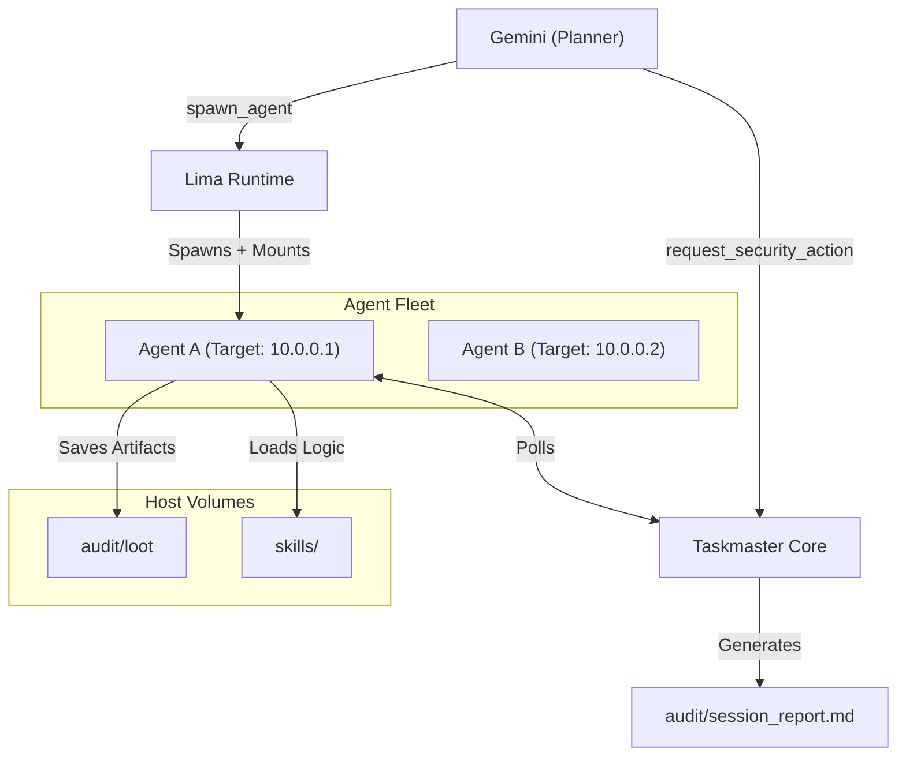

# Taskmaster: Agentic Security Orchestration Platform

Taskmaster is a stateful Model Context Protocol (MCP) server that transforms security assessments into an autonomous, agent-driven workflow. It manages a fleet of specialized Kali Linux containers, enforcing phase policies and providing a structured "Skills" framework for expert-level execution.

## 🏗 Architecture

Taskmaster coordinates a **Planner** (Gemini) and a dynamic fleet of **Specialized Agents**.



### Key Components

1.  **Taskmaster Core**: 
    *   **State Management**: Tracks lifecycles (`QUEUED` -> `CLAIMED` -> `RUNNING` -> `COMPLETED`).
    *   **Target Locking**: Prevents overlapping actions on the same target.
    *   **Audit Manager**: Automatically generates a Markdown report and JSONL logs in the `audit/` folder.

2.  **Universal Agent ("Smart Operator")**: 
    *   **Specialization**: Containers are "mission-aware" at runtime.
    *   **Structured Pipeline**: Automatically detects and parses `.json` and `.xml` files created in `/loot`.
    *   **Skills Library**: A mounted library of Python-based expert modules (Subdomain enumeration, Cloud auditing, etc.).

## 🛡 Features & Safety

*   **Concurrency**: Uses `fcntl` file locking for safe state access and target-level execution locks.
*   **Networking**: Pre-configured for MaOS environments (`192.168.64.1`) with full host proxy and `proxychains4` integration.
*   **Persistent Loot**: All files saved to `/loot` in a container appear in `audit/loot/` on your host.

## 🚀 Getting Started

### Quick Start
```bash
# One-command setup
make dev

# Build agent container
make build

# Start server
make start

# In another terminal: spawn agent
make spawn
```

**See `QUICKSTART.md` for 5-minute setup or `SETUP.md` for detailed instructions.**

### MCP Client Configuration

Example configurations provided for:
- Gemini CLI (`examples/gemini-cli-settings.json`)
- Claude Desktop (`examples/claude-desktop-config.json`)
- Direct STDIO connection (`examples/mcp-stdio-settings.json`)

**See `examples/EXAMPLES.md` for detailed configuration guides.**

### The Agentic Workflow
1.  **Plan**: Request an action via `request_security_action`.
2.  **Spawn**: Launch a specialized agent via `spawn_agent`.
3.  **Review**: Watch the `audit/session_report.md` for live updates and structured findings.

## 🛠 Skills Library (`skills/`)

The system includes a library of expert-level Python skills:
- `subdomain.SubdomainSkill`: Passive (crt.sh) + Active (gobuster) discovery.
- `takeover.TakeoverSkill`: 14+ cloud provider CNAME fingerprints.
- `web.WebReconSkill`: Tech detection and `ffuf` integration.
- `cloud.CloudAuditSkill`: AWS/GCP identity and resource auditing.

## 🔑 Directory Structure

*   `audit/`: Contains the `session_report.md` and persistent `loot/`.
*   `skills/`: Reusable Python modules for specialized tasks.
*   `executors/`: Dockerfile and operator logic for Kali Linux.
*   `tools/`: 13 MCP tool handlers for orchestration (spawning, tracking, waiting, cleanup).
