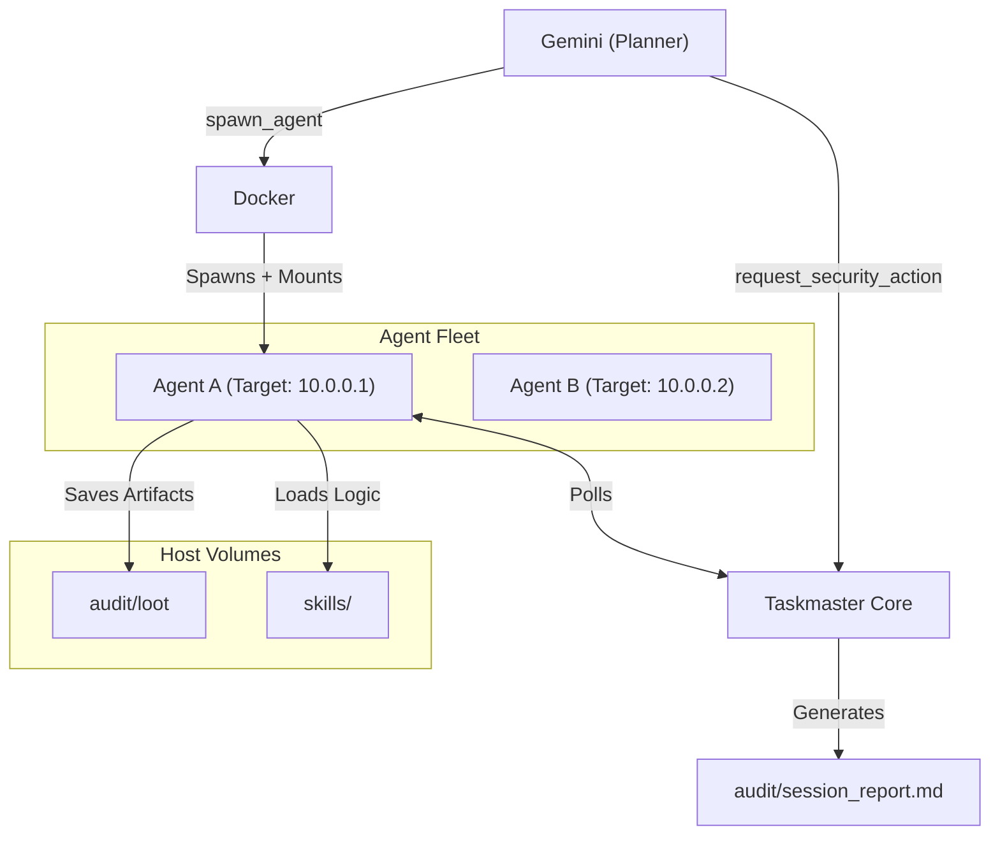

# Taskmaster: Agentic Security Orchestration Platform

Taskmaster is a stateful Model Context Protocol (MCP) server that transforms security assessments into an autonomous, agent-driven workflow. It manages a fleet of specialized Kali Linux containers, enforcing phase policies and providing a structured "Skills" framework for expert-level execution.

## 🏗 Architecture

Taskmaster coordinates a **Planner** (Gemini) and a dynamic fleet of **Specialized Agents**.


```mermaid
graph TD
    Gemini["Gemini (Planner)"] -->|"spawn_agent"| Docker["Docker"]
    Gemini -->|"request_security_action"| TM["Taskmaster Core"]
    
    subgraph "Agent Fleet"
        Agent1["Agent A (Target: 10.0.0.1)"]
        Agent2["Agent B (Target: 10.0.0.2)"]
    end

    Docker -->|"Spawns + Mounts"| Agent1
    Agent1 <-->|"Polls"| TM
    
    subgraph "Host Volumes"
        Loot["audit/loot"]
        Skills["skills/"]
    end
    
    Agent1 -->|"Saves Artifacts"| Loot
    Agent1 -->|"Loads Logic"| Skills
    TM -->|"Generates"| Report["audit/session_report.md"]
```

### Key Components

1.  **Taskmaster Core**: 
    *   **State Management**: Tracks lifecycles (`QUEUED` -> `CLAIMED` -> `RUNNING` -> `COMPLETED`).
    *   **Target Locking**: Prevents overlapping actions on the same target.
    *   **Audit Manager**: Automatically generates a Markdown report and JSONL logs in the `audit/` folder.

2.  **Kali Agent ("Smart Operator")**:
    *   **Specialization**: Containers are "mission-aware" at runtime.
    *   **Two Pathways**: Executes via skill classes (JSON envelope output) or Python sandbox — no raw shell commands.
    *   **Skills Library**: A mounted library of one-tool-per-class Python modules with structured JSON output.

3.  **Playwright Executor**:
    *   **Browser-native**: A lightweight `python:3.12-slim` container with Playwright + Chromium. No Kali tooling.
    *   **Two Pathways**: `playwright_skill` (imports a `BaseBrowserSkill` subclass) or `playwright` (raw Python/Playwright script in a subprocess).
    *   **Selective claiming**: Only picks up tasks with `action_type: "playwright"` or `"playwright_skill"`; Kali tasks are left for the Kali operator.

### Planning Guidance

When choosing how to execute a task:
- Use `action_type: "python"` for simple passive HTTP fetch/parse work, JSON processing, and glue logic.
- Use `action_type: "skill"` when an existing external tool materially improves the result.
- Create a new skill only for reusable tool-backed workflows, not for one-off parsing or fetch tasks.
- Use Playwright only when rendered DOM or browser interaction is required.

## 🛡 Features & Safety

*   **Concurrency**: Uses `fcntl` file locking for safe state access and target-level execution locks.
*   **Networking**: Pre-configured for Docker Desktop on macOS/Windows (`host.docker.internal`). Linux users set `TASKMASTER_HOST` to the `docker0` bridge IP. Full host proxy and `proxychains4` integration included.
*   **Persistent Loot**: All files saved to `/loot` in a container appear in `audit/loot/` on your host.

## 🚀 Getting Started

### Quick Start
```bash
# One-command setup
make dev

# Build agent container
make build

# Start server
make start

# In another terminal: spawn agent
make spawn
```

**See `QUICKSTART.md` for 5-minute setup or `SETUP.md` for detailed instructions.**

### MCP Client Configuration

Example configurations provided for:
- Gemini CLI (`examples/gemini-cli-settings.json`)
- Claude Desktop (`examples/claude-desktop-config.json`)
- Direct STDIO connection (`examples/mcp-stdio-settings.json`)

**See `examples/EXAMPLES.md` for detailed configuration guides.**

### The Agentic Workflow
1.  **Plan**: Request an action via `request_security_action`.
2.  **Spawn**: Launch a specialized agent via `spawn_agent`.
3.  **Review**: Watch the `audit/session_report.md` for live updates and structured findings.

## 🛠 Skills Library (`skills/`)

Each skill wraps exactly one CLI tool and produces a standardized JSON envelope with `findings`, `artifacts`, and `errors`.

| Skill | Tool | Description |
|-------|------|-------------|
| `network.FpingSweep` | `fping` | Ping sweep to discover alive hosts |
| `network.NmapScan` | `nmap` | Service/version scan with XML parsing |
| `web.FfufFuzz` | `ffuf` | Directory and endpoint fuzzing |
| `web.HttpxDetect` | `httpx` | Technology detection and fingerprinting |
| `subdomain.GobusterDns` | `gobuster` | Active DNS subdomain brute-force |
| `subdomain.SubfinderEnum` | `subfinder` | Passive subdomain enumeration |
| `takeover.NucleiTakeover` | `nuclei` | Subdomain takeover detection |
| `cloud.AwsCliAudit` | `aws` | AWS identity, S3, and IAM auditing |
| `cloud.GcloudAudit` | `gcloud` | GCP project and config auditing |

**Browser skills** (run in the Playwright executor, extend `BaseBrowserSkill` from `skills/browser.py`):

| Base Class | Engine | Description |
|------------|--------|-------------|
| `browser.BaseBrowserSkill` | Playwright | Abstract base for browser-automation skills. Subclasses implement `run_browser(page, context, **kwargs)`. |

See `skills/TEMPLATE.md` for creating new skills (both CLI and browser variants).

## 📊 Dashboard

Taskmaster ships with a built-in web dashboard for real-time monitoring. Start the HTTP server and open `http://localhost:5000` in your browser.

```bash
uv run python server.py --http
```

**Tabs:**
- **Executions** — live table with status badges. Click any row to expand full request/result detail (justification, tool, command, findings, artifacts, errors).
- **Targets** — per-target cards with phase progress bars. Expand to see executions grouped by security phase.
- **Agents** — agent history with container info and task stats. Expand for full task history table.
- **Findings** — severity badges, CVSS scores, risk descriptions, remediation guidance, and references when available.

**Features:** HTMX-powered auto-refresh (pauses when a detail is open), deep-linking between views (click a target/agent/execution ID to jump and auto-expand), dark theme.

## 🔑 Directory Structure

*   `audit/`: Contains the `session_report.md` and persistent `loot/`.
*   `dashboard/`: Web UI — API handlers, Jinja2 templates, static assets.
*   `skills/`: Reusable Python modules for specialized tasks. `base.py` for CLI skills, `browser.py` for Playwright-based skills.
*   `executors/`: Operator logic and Dockerfiles for both executor types:
    *   `Dockerfile` + `kali_operator.py` — Kali Linux agent (CLI tools, `skill`/`python` action types)
    *   `Dockerfile.playwright` + `playwright_operator.py` — Playwright agent (browser, `playwright_skill`/`playwright` action types)
*   `tools/`: 13 MCP tool handlers for orchestration (spawning, tracking, waiting, cleanup).
