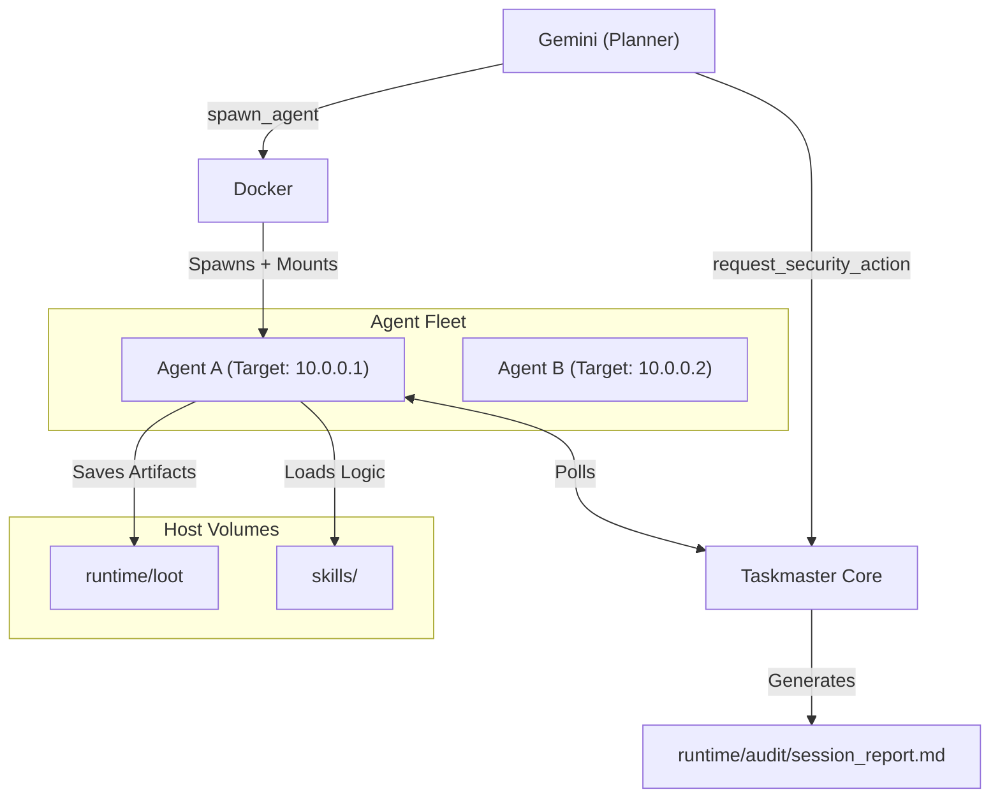

# Taskmaster: Agentic Security Orchestration Platform

Taskmaster is a stateful Model Context Protocol (MCP) server that transforms security assessments into an autonomous, agent-driven workflow. It manages a fleet of specialized Kali Linux containers, enforcing phase policies and providing a structured "Skills" framework for expert-level execution.

## 🏗 Architecture

Taskmaster coordinates a **Planner** (Gemini) and a dynamic fleet of **Specialized Agents**.


```mermaid
graph TD
    Gemini["Gemini (Planner)"] -->|"spawn_agent"| Docker["Docker"]
    Gemini -->|"request_security_action"| TM["Taskmaster Core"]
    
    subgraph "Agent Fleet"
        Agent1["Agent A (Target: 10.0.0.1)"]
        Agent2["Agent B (Target: 10.0.0.2)"]
    end

    Docker -->|"Spawns + Mounts"| Agent1
    Agent1 <-->|"Polls"| TM
    
    subgraph "Host Volumes"
        Loot["runtime/loot"]
        Skills["skills/"]
    end
    
    Agent1 -->|"Saves Artifacts"| Loot
    Agent1 -->|"Loads Logic"| Skills
    TM -->|"Generates"| Report["runtime/audit/session_report.md"]
```

### Key Components

1.  **Taskmaster Core**: 
    *   **State Management**: Tracks lifecycles (`QUEUED` -> `CLAIMED` -> `RUNNING` -> `COMPLETED`).
    *   **Target Locking**: Prevents overlapping actions on the same target.
    *   **Audit Manager**: Automatically generates a Markdown report and JSONL logs in the `runtime/audit/` folder.

2.  **Kali Agent ("Smart Operator")**:
    *   **Specialization**: Containers are "mission-aware" at runtime.
    *   **Two Pathways**: Executes via skill classes (JSON envelope output) or Python sandbox — no raw shell commands.
    *   **Skills Library**: A mounted library of one-tool-per-class Python modules with structured JSON output.
    *   **PDTM bootstrapping**: ProjectDiscovery-backed skills can install their own missing binaries on first use via `pdtm`.

3.  **Playwright Executor**:
    *   **Browser-native**: A lightweight `python:3.12-slim` container shipping three selectable browser engines for fingerprint-protected targets — vanilla Playwright (Chromium), Patchright (anti-detection Chromium drop-in, **default**), and Camoufox (fingerprint-hardened custom Firefox). No Kali tooling.
    *   **Two Pathways**: `playwright_skill` (imports a `BaseBrowserSkill` subclass) or `playwright` (raw Python/Playwright script in a subprocess). Both honor the per-spawn `browser_engine` setting via the `BROWSER_ENGINE` env var.
    *   **Selective claiming**: Only picks up tasks with `action_type: "playwright"` or `"playwright_skill"`; Kali tasks are left for the Kali operator.

4.  **Reporting Executor**:
    *   **Document renderer**: A slim `python:3.12` container with `docxtpl`, `python-docx`, and `pyyaml`. No security tooling — its only job is to turn structured findings into branded deliverables.
    *   **One Pathway**: `report_skill` (imports a `BaseReportSkill` subclass — e.g. `reporting.FindingDocxReport`).
    *   **Selective claiming**: Only picks up tasks with `action_type: "report_skill"`; everything else is left for the Kali / Playwright operators.
    *   **Template-driven**: Renders a docxtpl template (`templates/finding_template.docx`) produced from a hand-formatted example via `scripts/build_finding_template.py`. Source-document layout (fonts, table widths, headers/footers) is preserved, so the output opens cleanly in Word and Google Docs.
    *   **Database-backed**: Report findings are stored in Taskmaster's SQLite state as first-class reporting records. Execution results remain an event log; report findings are the curated client-facing source of truth. Manage them through the reporting MCP tools or the dashboard's **Report Findings** page.

### Planning Guidance

When choosing how to execute a task:
- Use `action_type: "python"` for simple passive HTTP fetch/parse work, JSON processing, and glue logic.
- Use `action_type: "skill"` when an existing external tool materially improves the result.
- Create a new skill only for reusable tool-backed workflows, not for one-off parsing or fetch tasks.
- Use Playwright only when rendered DOM or browser interaction is required.
- Use Taskmaster's reporting tools or the **Report Findings** dashboard page to store settled report findings, then `request_reporting_docx` or the dashboard's **Queue DOCX** action to queue the final `report_skill` render.
- If a ProjectDiscovery-backed skill is the right fit, it may bootstrap its binary through `pdtm` if the tool is not already present.

When a browser is required, spawn the worker with `agent_type: "playwright"` so the task is claimed by the Playwright executor instead of a Kali operator.
For browser navigation against modern apps, prefer `domcontentloaded` or `load` plus a short settle delay over `networkidle`, which often hangs on challenge or long-polling traffic.
Playwright agents default to `interactive_browser=true`, which publishes a local noVNC session for live inspection and manual interaction.

## 🛡 Features & Safety

*   **Concurrency**: Uses `fcntl` file locking for safe state access and target-level execution locks.
*   **Networking**: Pre-configured for Docker Desktop on macOS/Windows (`host.docker.internal`). Linux users set `TASKMASTER_HOST` to the `docker0` bridge IP. Full host proxy and `proxychains4` integration included.
*   **Persistent Loot**: All files saved to `/loot` in a container appear in `runtime/loot/` on your host. Rendered docx deliverables land in `runtime/reports/`.

## 🚀 Getting Started

### Quick Start
```bash
# One-command setup
make dev

# Build agent container
make build

# Start server
make start

# In another terminal: spawn agent
make spawn
```

**See `QUICKSTART.md` for 5-minute setup or `SETUP.md` for detailed instructions.**

### MCP Client Configuration

Example configurations provided for:
- Gemini CLI (`examples/gemini-cli-settings.json`)
- Claude Desktop (`examples/claude-desktop-config.json`)
- Direct STDIO connection (`examples/mcp-stdio-settings.json`)

**See `examples/EXAMPLES.md` for detailed configuration guides.**

### The Agentic Workflow
1.  **Orient**: Call `suggest_next_action` to see the prioritized gaps in the current state (failed work, executions missing an interpretation, findings not yet report-ready, phase holes, threat-model status). New to the session? `get_operational_guide` serves the canonical operating manual.
2.  **Plan**: Request a single action via `request_security_action`, or lay down an ordered, self-gating sequence with `request_playbook` (named playbook or inline steps). Chain manual work with `depends_on`.
3.  **Spawn**: Launch a specialized agent via `spawn_agent`.
4.  **Review**: Watch `runtime/audit/session_report.md` for live updates and structured observations, or the **Overview** dashboard page for the at-a-glance picture.

Taskmaster is a stateful orchestrator, not an autopilot — the methodology stays with the operating LLM. `suggest_next_action`, `request_playbook`, dependency chains, and the operational guide exist to make that orchestration less manual and more consistent across MCP clients (Claude Code, Codex, and others).

### Interactive Playwright Sessions

Playwright agents expose a local noVNC browser view by default. This is useful when a task may require manual input such as MFA, cookie consent, bot challenges, or SSO.

`spawn_agent` supports these Playwright-specific fields:
- `interactive_browser`: defaults to `true` for `agent_type: "playwright"`. Set `false` only for fully unattended browser runs.
- `interactive_hold_ms`: how long a browser skill should keep the live session open before collecting final observations.
- `novnc_port`: optional fixed localhost port for the noVNC session. If omitted, Taskmaster selects a free port automatically.
- `browser_engine`: `"playwright" | "patchright" | "camoufox"`. Defaults to `"patchright"`. Use `"camoufox"` when a target sits behind aggressive bot defenses that Patchright still trips (Akamai Bot Manager, PerimeterX). Use `"playwright"` only when you specifically need a non-patched baseline. See the "Bot-Protected Targets" section in `OPERATIONAL_GUIDE.md` for the full three-tier ladder, including `curl_cffi` for JS-free recon on a Kali agent.

Example:
```json
{
  "tool": "spawn_agent",
  "arguments": {
    "agent_type": "playwright",
    "target": "https://app.example.com",
    "interactive_browser": true,
    "interactive_hold_ms": 180000,
    "novnc_port": 6085
  }
}
```

When a Playwright task is running, open the returned noVNC URL in your host browser, for example `http://127.0.0.1:6085/vnc.html`.

## Reporting Database Workflow

Taskmaster now separates two concepts that used to be easy to confuse:

- **Execution observations** are raw or semi-structured results returned by Kali, Playwright, or reporting workers. They stay attached to executions and appear in the dashboard's **Observations** tab.
- **Report findings** are curated, client-facing findings stored in the reporting tables (`engagements`, `findings`, `finding_evidence`, `finding_references`). They are managed through MCP tools or the dashboard's **Report Findings** page, and are not mixed into the execution observations UI.

This workflow replaces pwndoc as the reporting source of truth. Do not maintain a pwndoc sync layer or carry pwndoc-specific IDs into Taskmaster report findings.

Preferred reporting flow:

1. Create an engagement with `create_reporting_engagement`.
2. Promote a settled observation with `create_reporting_finding`. Include `engagement_id`, client-facing prose, severity, affected asset, proof of concept, remediation, optional CVSS, optional references, optional evidence, and `source_execution_id` when the finding came from a Taskmaster execution.
3. Refine scalar fields with `update_reporting_finding`. Add proof material with `add_reporting_finding_evidence` and `add_reporting_finding_reference`; evidence and references are separate so edits do not silently replace the proof trail.
4. Review stored records with `get_reporting_finding` or `list_reporting_findings`. Each response includes `report_shape`, the dict shape expected by `reporting.FindingDocxReport`.
5. Queue a document render with `request_reporting_docx`, using either `finding_ids` or an `engagement_id` plus optional `status`.
6. Spawn a reporting worker with `spawn_agent(agent_type="reporting")`, then monitor the queued render with `wait_for_completion`.

The dashboard supports the same reporting database flow. The **Engagements** hub (`/reporting/engagements`) is the primary surface: per-engagement severity/status rollups, an editable scope panel, a filtered findings list with inline status transitions, and a render-history panel where finished DOCX deliverables can be downloaded. The flat **Report Findings** view (`/reporting/findings`) remains for cross-engagement create/edit/filter/queue. Queuing a render from either page still creates a normal Taskmaster execution; a compatible `reporting` worker must claim it before a document is produced.

`request_reporting_docx` validates report readiness before it queues work. A finding must have `title`, `severity`, `category`, `affected`, `description`, `impact`, `proof_of_concept`, and `remediation`; incomplete findings return a `not_ready` list instead of producing a weak deliverable.

Current DOCX rendering uses the finding body fields plus references. Fenced Markdown code blocks and inline backticks are rendered as Word code formatting. Markdown pipe tables remain literal text, and attached evidence records are stored for traceability but are not yet rendered into a dedicated report evidence section.

The lower-level `reporting.FindingDocxReport` skill still accepts direct `finding`, `findings`, or `findings_path` arguments, but the database-backed tools are the preferred path for normal engagements.

## 🛠 Skills Library (`skills/`)

Each skill wraps exactly one CLI tool and produces a standardized JSON envelope with `findings`, `artifacts`, and `errors`. The `findings` key is a legacy envelope field; in user-facing dashboard language, those values are execution observations.

| Skill | Tool | Description |
|-------|------|-------------|
| `network.FpingSweep` | `fping` | Ping sweep to discover alive hosts |
| `network.NmapScan` | `nmap` | Service/version scan with XML parsing |
| `web.FfufFuzz` | `ffuf` | Directory and endpoint fuzzing |
| `web.HttpxDetect` | `httpx` | Technology detection and fingerprinting |
| `subdomain.GobusterDns` | `gobuster` | Active DNS subdomain brute-force |
| `subdomain.SubfinderEnum` | `subfinder` | Passive subdomain enumeration |
| `takeover.NucleiTakeover` | `nuclei` | Subdomain takeover detection |
| `cloud.AwsCliAudit` | `aws` | AWS identity, S3, and IAM auditing |
| `cloud.GcloudAudit` | `gcloud` | GCP project and config auditing |

**Browser skills** (run in the Playwright executor, extend `BaseBrowserSkill` from `skills/browser.py`):

| Base Class | Engine | Description |
|------------|--------|-------------|
| `browser.BaseBrowserSkill` | Playwright | Abstract base for browser-automation skills. Subclasses implement `run_browser(page, context, **kwargs)`. |
| `browser.RenderedPageObserve` | Playwright | Resilient rendered-page observation using `domcontentloaded` plus a settle delay, with DOM and resource summaries. |

**Reporting skills** (run in the Reporting executor, extend `BaseReportSkill` from `skills/reporting.py`):

| Skill Class | Backend | Description |
|-------------|---------|-------------|
| `reporting.BaseReportSkill` | docxtpl | Abstract base for document-rendering skills. Subclasses implement `render(**kwargs) -> dict`. |
| `reporting.FindingDocxReport` | docxtpl | Renders a **single** branded docx from a finding dict, list of findings, or YAML/JSON file. Multi-finding renders produce one combined document with a page break between findings. Uses `templates/finding_template.docx`; writes to `/reports/` (host `runtime/reports/`) by default. Filename derives from the common dotted prefix of the finding ids (e.g. `BHI-OFFSEC-25.05`) or the target slug. |

See `skills/TEMPLATE.md` for creating new skills (CLI, browser, and reporting variants) and `templates/README.md` for converting an example docx into a docxtpl template the reporting executor can render.

## 📊 Dashboard

Taskmaster ships with a built-in web dashboard for real-time monitoring. Start the HTTP server and open `http://localhost:5001` in your browser.

```bash
uv run python server.py --http
```

The server runs two listeners: the **MCP JSON-RPC endpoint** on `TASKMASTER_HOST:TASKMASTER_PORT` (default `0.0.0.0:5000`, reachable by agent containers via `host.docker.internal`) and the **dashboard** on `TASKMASTER_DASHBOARD_HOST:TASKMASTER_DASHBOARD_PORT` (default `127.0.0.1:5001`, loopback-only so it is not exposed beyond this machine). Override with `--dashboard-host` / `--dashboard-port` or the matching env vars.

The sidebar groups the tabs into **Operations** (Overview, Executions, Targets, Agents, Observations) and **Reporting** (Engagements, Report Findings). Both listeners also answer `GET /healthz` for liveness checks.

**Tabs:**
- **Overview** — the landing page and screen-share home: a findings-by-severity chart, phase-coverage meters, and Recent activity + Latest findings lists. Respects the engagement scope selector. This is the one page that also carries the execution/finding stats bar.
- **Executions** — live table with status badges. Click any row to expand full request/result detail (justification, tool, command, observation data, artifacts, errors). Rows in a dependency chain show a `⛓` chip; cascade-cancelled rows carry their cancel reason.
- **Targets** — per-target cards with phase progress bars. Expand to see executions grouped by security phase.
- **Agents** — agent history with container info and task stats. Expand for full task history table.
- **Observations** — execution-derived observations and results only.
- **Engagements** — the engagement-centric reporting hub. The list view shows per-engagement finding, severity, and scope rollups; each engagement's workspace (`/reporting/engagements/<id>`) has severity/status pipeline rollups, a filtered findings list with an inline status control, an editable scope panel (`report_assets`), a render-history panel with DOCX download links, and an **evidence-grounded threat model** (assumptions, assets, attack surface, trust boundaries, attack paths, test objectives, mitigations, open questions) rendered as tables and exportable as a `<name>-threat-model.md` deliverable.
- **Report Findings** — flat cross-engagement view of client-facing reporting records. Create/edit findings, append evidence and references, filter by engagement/status/severity, and queue DOCX renders.

**Engagement scope selector:** a dashboard-wide selector (top of the main pane, remembered across pages via a cookie) filters the Overview, Executions, Observations, Targets, and Agents views to a single engagement. It is hidden on the Engagements and Report Findings pages, which carry their own engagement filters. Executions are bound to an engagement explicitly by an `engagement_id` set at queue time — pass `engagement_id` to `request_security_action` (validated against existing engagements), and reporting renders inherit it. This keeps two engagements assessed over the same or overlapping scope cleanly separated. You can also tag or re-assign an execution after the fact from its detail panel in the Executions tab. Untagged/legacy executions appear only under "All engagements".

**Features:** HTMX-powered auto-refresh (pauses when a detail is open), deep-linking between views (click a target/agent/execution ID to jump and auto-expand), Targets/Agents detail as a real show/hide toggle, an execution/finding stats bar on the Overview page, markdown-rendered finding bodies, dark theme.

## 🔑 Directory Structure

*   `runtime/` (under `WORK_DIR`, gitignored): runtime artifacts — `loot/` (tool outputs), `reports/` (rendered docx deliverables), `audit/` (`session_report.md`, `audit_log.jsonl`), `state/` (sqlite DB), `session/` (user-supplied session material, mounted read-only at `/session`).
*   `dashboard/`: Web UI — API handlers, Jinja2 templates, static assets.
*   `skills/`: Reusable Python modules for specialized tasks. `base.py` for CLI skills, `browser.py` for Playwright-based skills, `reporting.py` for document-rendering skills.
*   `executors/`: Operator logic and Dockerfiles for all three executor types:
    *   `Dockerfile` + `kali_operator.py` — Kali Linux agent (CLI tools, `skill`/`python` action types)
    *   `Dockerfile.playwright` + `playwright_operator.py` — Playwright agent (browser, `playwright_skill`/`playwright` action types)
    *   `Dockerfile.reporting` + `report_operator.py` — Reporting agent (docxtpl renderer, `report_skill` action type)
*   `templates/`: docxtpl-tagged document templates consumed by the reporting executor. See `templates/README.md` for how to produce a new template from an example docx.
*   `scripts/`: Build / spawn helpers. Notable: `scripts/build_finding_template.py` rewrites an example docx into a docxtpl-tagged template under `templates/`.
*   `tools/`: MCP tool handlers for orchestration (spawning, tracking, waiting, cleanup) and database-backed reporting (`create_reporting_finding`, `request_reporting_docx`, etc.).
